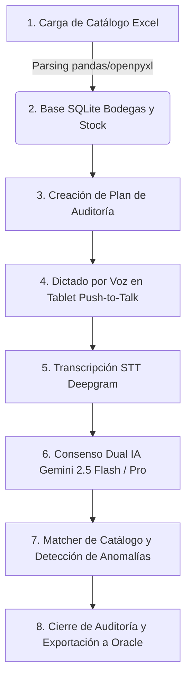

# 🎙️ Minka — Voice Inventory Counter
> **Hackathon Colsubsidio x 30X · Reto de Hospitalidad (Julio 2026)**  
> *Transformando el conteo físico de inventario en restaurantes y hoteles: de lápiz, papel y digitación manual a captura por voz ultra-rápida, validación por consenso triple de Inteligencia Artificial y exportación directa compatible con Oracle My Inventory.*

---

[](https://fastapi.tiangolo.com/)
[](https://astro.build/)
[](https://cloud.google.com/vertex-ai)
[](https://deepgram.com/)
[](https://www.docker.com/)
[](LICENSE)

---

## 📋 Tabla de Contenidos

- [💡 Visión General y Propósito del Proyecto](#-visión-general-y-propósito-del-proyecto)
- [👥 Equipo de Desarrollo](#-equipo-de-desarrollo)
- [🔄 El Flujo Operativo End-to-End](#-el-flujo-operativo-end-to-end)
- [📱 Flujos de Pantallas y Experiencia de Usuario (UI/UX)](#-flujos-de-pantallas-y-experiencia-de-usuario-uiux)
  - [1. App del Operador (`/conteo`) — Captura por Voz en Tablet/Móvil](#1-app-del-operador-conteo--captura-por-voz-en-tabletmóvil)
  - [2. Plataforma del Auditor (`/auditor`) — Control y Cierre ERP](#2-plataforma-del-auditor-auditor--control-y-cierre-erp)
- [🏗️ Arquitectura del Sistema y Componentes](#️-arquitectura-del-sistema-y-componentes)
- [🛠️ Tecnologías y Herramientas Utilizadas](#️-tecnologías-y-herramientas-utilizadas)
- [📁 Estructura Completa del Repositorio](#-estructura-completa-del-repositorio)
- [📊 Suite Diagnóstica y Resultados del Benchmark ($N=1,904$)](#-suite-diagnóstica-y-resultados-del-benchmark-n1904)
- [⚡ Guía de Instalación y Despliegue Paso a Paso](#-guía-de-instalación-y-despliegue-paso-a-paso)
- [🧪 Estrategia de Pruebas y TDD](#-estrategia-de-pruebas-y-tdd)
- [🔒 Privacidad, Seguridad y Cumplimiento Normativo (Ley 1581 / ISO 27001)](#-privacidad-seguridad-y-cumplimiento-normativo-ley-1581--iso-27001)
- [📚 Documentación Adicional y Fuentes](#-documentación-adicional-y-fuentes)
- [📜 Licencia y Estado](#-licencia-y-estado)

---

## 💡 Visión General y Propósito del Proyecto

En la operación de hoteles, restaurantes y centros de convenciones de Colsubsidio, la toma física de inventario de materia prima (alimentos, bebidas y suministros) ha sido históricamente un proceso crítico pero propenso al error humano:

```
❌ FLUJO TRADICIONAL (Lento e ineficiente):
[Operador cuenta en bodega] ➔ [Anota a lápiz en papel] ➔ [Digitalizador re-digita en plantilla] ➔ [Carga a ERP Oracle] ➔ [Auditor detecta errores y re-cuenta]
```

**Minka** es la solución tecnológica diseñada para el **Reto de Hospitalidad de la Hackathon Colsubsidio x 30X**. Elimina el uso del papel y la redundancia de digitación, introduciendo una aplicación móvil y web con botón *Push-to-Talk* que permite dictar el inventario de manera natural.

```
✅ FLUJO MINKA (Ultra-rápido y validado):
[Dictado por Voz en Tablet] ➔ [Transcripción STT + Normalización] ➔ [Consenso Dual IA Gemini] ➔ [Búsqueda Difusa en Catálogo] ➔ [Exportación Oracle My Inventory]
```

> **📌 Principio Clave:** Minka **NO reemplaza el ERP Oracle My Inventory**, sino que le suministra datos limpios, validados y auditables a la primera (*Right First Time*), reduciendo el tiempo de toma de inventario en más de un 70%.

---

## 👥 Equipo de Desarrollo

| Rol | Integrantes | Enfoque Principal |
|---|---|---|
| **Implementación Técnica y Arquitectura** | **Braejan David Arias Heregua**<br>**Daniel Rosas** | Microservicios FastAPI, motores de IA Vertex/Gemini, STT Deepgram, matcher vectorial SQLite, frontend Astro/Preact y suite de benchmarks. |
| **Documentación, Casos de Uso y QA** | **Adriana Durand** *(Invitado)*<br>**Edith Lavado** | Definición del PRD, diseño de casos de uso de negocio, dataset de pruebas de voz real y aseguramiento de calidad. |
| **Sponsor / Host del Desafío** | **30X · Colsubsidio** | Definición del reto de hospitalidad y validación de reglas de negocio. |

*Para consultar la especificación detallada de requerimientos, revisa el [PRD v1.0](file:///c:/Users/drosa/Documents/Workspace/2026_07_25_repo_oficial/colsubsidio30x-minka/docs/prd.md).*

---

## 🔄 El Flujo Operativo End-to-End

El sistema opera bajo un flujo de 8 pasos continuos y trazables:



1. **Configuración del Catálogo (Auditor, Web)**: Ingesta del archivo maestro `BODEGAS Y STOCK.xlsx`. El sistema procesa los 1,405 SKUs y 8 catálogos, calculando parámetros estadísticos por producto.
2. **Creación del Plan de Auditoría (Auditor, Web)**: Selección de bodega destino, rango de fechas y asignación de operadores autorizados.
3. **Toma de Conteo por Voz (Operador, Tablet)**: El operador presiona el botón *Push-to-Talk* y dicta de forma espontánea: *"150 kilos de arroz blanco y 20 litros de aceite de girasol"*.
4. **Extracción Estructurada por IA (Motor de IA)**:
   - **STT**: Transcripción de audio a texto y Normalización Inversa de Texto (ITN, ej: *"novecientos"* $\rightarrow$ `900`).
   - **Extractor Dual LLM**: Tres modelos en paralelo procesan el texto y generan un esquema JSON `{producto, cantidad, unidad, bodega}`.
5. **Validación de Consenso**: Dos modelos (Gemini 2.5 Flash y Gemini Pro en Google Vertex AI) evalúan la extracción. Si coinciden (`EXACT_CONSENSUS`), el registro se convalida automáticamente.
6. **Validación de Reglas de Negocio y Detección de Anomalías**: Verificación automática contra la base SQLite: ¿Existe el producto en esa bodega? ¿La unidad corresponde? ¿La cantidad es atípica frente al histórico? Ante divergencias, se emite una alerta preventiva.
7. **Revisión y Corrección en Sitio (Operador y Auditor)**: Si hay un error, el operador elimina el registro y vuelve a dictar (por seguridad RNF-04, la voz **nunca** edita ni borra registros existentes directamente).
8. **Cierre y Exportación ERP**: Generación de archivo en formato **Oracle My Inventory** (estilo *Import Count Sequences*), junto con reporte de conciliación y log de auditoría ISO 27001.

---

## 📱 Flujos de Pantallas y Experiencia de Usuario (UI/UX)

La aplicación fue desarrollada en **Astro + Preact + TypeScript** con un diseño moderno, responsivo y adaptado a las condiciones de trabajo en bodegas y cocinas.

### 1. App del Operador (`/conteo`) — Captura por Voz en Tablet/Móvil
- **Objetivo**: Diseñada prioritariamente para pantallas táctiles de móviles/tablets (resolución objetivo 390×844).
- **Flujo de Pantallas**:
  1. **Selección de Plan / Catálogo**: El operador elige la bodega a auditar (ej. *Cocina Principal*, *Bar*, *Bodega Secos*).
  2. **Interfaz Push-to-Talk (Mic Dock)**: Un botón flotante central de gran tamaño para presionar mientras se habla.
     - **Límite de Seguridad**: Auto-stop configurado a los 20 segundos o máximo 1 MB por clip de audio.
     - **Formato Nativo**: Captura directa Opus (`audio/ogg` en Firefox, `audio/webm` en Chrome).
  3. **Tarjeta de Confirmación Visual en Tiempo Real**:
     - Visualización inmediata de la transcripción.
     - Separación automática de ítems dictados en tarjetas independientes (ej. Tarjeta 1: *Arroz 150 Kg*, Tarjeta 2: *Aceite 20 L*).
     - Banderas de color: 🟢 Validado con éxito | 🟠 Alerta de anomalía (requiere revisión).

### 2. Plataforma del Auditor (`/auditor`) — Control y Cierre ERP
- **Objetivo**: Diseñada para tablets en modo horizontal (1194×834) y computadores de escritorio.
- **Flujo de Pantallas**:
  1. **Dashboard de Supervisión en Vivo**: Muestra el avance del conteo por bodega, total de SKUs registrados y porcentaje de discrepancias.
  2. **Módulo de Resolución de Anomalías**: Permite al auditor revisar ítems marcados con bandera naranja, escuchar el dictado si aplica o conciliar diferencias de inventario.
  3. **Generador de Exportación Oracle**: Botón de un solo clic que compila el conteo cerrado en la estructura exacta de importación de secuencias de conteo de Oracle My Inventory.

---

## 🏗️ Arquitectura del Sistema y Componentes

El sistema se compone de **4 microservicios independientes** desacoplados, desplegados mediante un único archivo `docker-compose.yml`:

```
                           +-------------------------------+
                           |      Cliente Tablet / Web     |
                           |   Astro + Preact (Puerto 4321)|
                           +---------------+---------------+
                                           |
                                    (Proxy HTTP API)
                                           |
        +----------------------------------+----------------------------------+
        |                                  |                                  |
        v                                  v                                  v
+---------------+                  +---------------+                  +---------------+
| Microservicio |                  | Microservicio |                  | Microservicio |
|    STT        |                  | Extractor IA  |                  |    Matcher    |
| (Puerto 8001) |                  | (Puerto 8003) |                  | (Puerto 8002) |
+-------+-------+                  +-------+-------+                  +-------+-------+
        |                                  |                                  |
        v                                  v                                  v
  Deepgram API                     Vertex AI / Gemini                   SQLite Database
 (Audio a Texto)                 (Consenso Dual LLM)               (1,405 SKUs / Read-Only)
```

### Descripción de los Microservicios

1. **Frontend Proxy (`frontend`) — Puerto 4321**:
   - Desarrollado en Astro con SSR (Server-Side Rendering) en Node.js.
   - Actúa como proxy seguro de las peticiones a los microservicios backend para evitar CORS y proteger los endpoints internos.

2. **Servicio Speech-to-Text (`services/stt`) — Puerto 8001**:
   - API en FastAPI encargada de transformar la voz del operador en texto.
   - **Jerarquía de Resiliencia Multi-Proveedor**: Deepgram Nova-2 (Principal) $\rightarrow$ ElevenLabs (Reserva) $\rightarrow$ Groq Whisper (Fallback).
   - **RNF-04**: El audio jamás se guarda en disco; se procesa en memoria volátil en streaming.

3. **Servicio de Extracción por IA (`services/product_identification`) — Puerto 8003**:
   - API en FastAPI con integración a Google Vertex AI.
   - Ejecuta un consenso dual entre **Gemini 2.5 Flash** (rápido y eficiente) y **Gemini Pro** (razonamiento complejo) para estructurar el texto dictado en un objeto JSON estandarizado.

4. **Servicio Matcher de Catálogo (`services/matcher`) — Puerto 8002**:
   - Engine de búsqueda difusa y matemática sobre la base SQLite (`bodegas-y-stock.sqlite`).
   - Utiliza combinación de algoritmos **RapidFuzz** + **Scoring por Trigramas** para vincular el término hablado con la descripción exacta del SKU en Oracle.
   - Latencia promedio de consulta: **6.38 ms**.

---

## 🛠️ Tecnologías y Herramientas Utilizadas

| Capa | Tecnología / Herramienta | Razón de Elección |
|---|---|---|
| **Lenguaje Backend** | Python 3.11+ (gestionado con `uv`) | Rapidez de ejecución, ecosistema de IA y manejo de entornos virtuales ultrarrápidos. |
| **Framework APIs** | FastAPI + Uvicorn | Alto rendimiento asíncrono y especificación OpenAPI automática. |
| **Frontend UI** | Astro 4 + Preact + TypeScript | Carga ultrarrápida, arquitectura de islas interactivas y tipado estricto. |
| **Base de Datos** | SQLite 3 (`pandas` + `openpyxl`) | Ligera, portable y montada en modo solo lectura (`mode=ro`) para prevenir corrupción. |
| **Motor de STT** | Deepgram API (Nova-2) | La menor latencia del mercado (<500 ms) y alta precisión en vocabulario en español. |
| **Modelos de IA** | Google Vertex AI (Gemini 2.5 Flash / Pro) | Consenso estocástico dual para cero alucinaciones de inventario. |
| **Matching Algorítmico** | RapidFuzz + Trigram Scoring | Coincidencia de cadenas de alta velocidad tolerante a errores ortográficos del STT. |
| **Contenedores** | Docker & Docker Compose | Despliegue reproducible de la arquitectura completa en cualquier entorno. |

---

## 📁 Estructura Completa del Repositorio

```
colsubsidio30x-minka/
├── .env.example               # Plantilla unificada de variables de entorno
├── docker-compose.yml         # Superficie única de despliegue Docker
├── Makefile                   # Accesos directos de automatización (build, test, run)
├── pyproject.toml             # Configuración del workspace global uv / Python
├── README.md                  # Puerta de entrada principal del proyecto
│
├── benchmarks/                # 📊 Suite de benchmarking y evaluación diagnóstica
│   ├── benchmark_execution.sqlite # Base de datos con las 1,904 ejecuciones
│   ├── corpus/                # Datasets de audio (238 clips en MP4 y OGG)
│   ├── dashboard/             # Tablero visual interactivo (index.html)
│   ├── docs/                  # Documentación metodológica detallada
│   └── reports/               # CSV consolidado para análisis en Excel
│
├── data/                      # 🗄️ Catálogo SQLite (generado a partir de Excel)
│   └── bodegas-y-stock.sqlite # Base de datos de 1,405 SKUs (gitignored)
│
├── docs/                      # 📚 Documentación técnica y de diseño
│   ├── prd.md                 # Documento de Requerimientos de Producto (PRD v1.0)
│   ├── deployment.md          # Guía de despliegue y variables de entorno
│   ├── database/              # Arquitectura de datos y tablas
│   └── diagrams/              # Diagramas Mermaid y flujos de arquitectura
│
├── frontend/                  # 📱 App Web Operador y Auditor (Astro + Preact)
│   ├── src/components/        # Componentes UI (Mic Dock, Auditor Panes, etc.)
│   ├── src/pages/             # Rutas (/conteo, /auditor, APIs de proxy)
│   └── package.json           # Dependencias Node.js
│
├── services/                  # ⚙️ Microservicios Backend en Python
│   ├── matcher/               # Módulo 3: Búsqueda difusa en catálogo (Puerto 8002)
│   ├── product_identification/ # Módulo 2: Extracción estructurada IA (Puerto 8003)
│   └── stt/                   # Módulo 1: Transcripción de voz STT (Puerto 8001)
│
├── scripts/                   # 🛠️ Scripts auxiliares
│   ├── build-sqlite.py        # Conversor de BODEGAS Y STOCK.xlsx a SQLite
│   ├── ingest_drive_dataset.py # Ingesta automática del dataset desde Google Drive
│   └── setup-env.sh           # Asistente interactivo de configuración .env
│
└── tests/                     # 🧪 Suite de pruebas integradas y de contrato
    ├── deployment/            # Pruebas de contrato de docker-compose y .env
    └── product_identification/ # Pruebas unitarias del extractor Gemini
```

---

## 📊 Suite Diagnóstica y Resultados del Benchmark ($N=1,904$)

Para demostrar la validez de Minka ante los jueces de la hackathon con **rigor científico y datos reales**, se construyó una suite de pruebas diagnósticas con audios grabados en campo por el equipo (*Adriana* y *Daniel*).

### 1. El Corpus de Pruebas Real en Google Drive
- **238 notas de voz reales** (133 clips de Adriana en `.mp4` + 105 clips de Daniel en `.ogg`).
- **4 Niveles de Dificultad Evaluados**:
  - 🟢 **Fácil**: Dictado directo de producto y cantidad (*"150 KILOS DE ARROZ"*).
  - 🟡 **Medio**: Dictado con contexto conversacional (*"Hola Carlos, en la bodega hay 90 kilos de lenteja"*).
  - 🔴 **Difícil**: Grabaciones con ruido de fondo de cocinas y extractores.
  - ⚪ **Garbage / Omitir**: Conversaciones cotidianas o ruido sin datos de inventario (verificación de cero alucinaciones).

> 🔗 **Acceso Público a Recursos de Benchmark**:
> - 📂 [Carpeta Compartida de Audios en Google Drive](https://drive.google.com/drive/u/1/folders/1e9a69v6Fz5m8o6XWsStagUtJKu-Hnuau)
> - 📊 [Hoja de Datos Adriana (BD_AUDIOS)](https://docs.google.com/spreadsheets/d/1UcAYiDXcqzjST9mM9x-Y9pZC142KsRl73PuG6677WaM)
> - 📊 [Hoja de Datos Daniel (BD_AUDIOS)](https://docs.google.com/spreadsheets/d/1nzou21xzFw4y5Npk0NJujcfwRGfPJsOWgYyfol2-oas)

### 2. Resultados Consolidados (8 Corridas Paralelas, $N = 1,904$ Evaluaciones en Vivo)

Debido a que los modelos de lenguaje son estocásticos, el benchmark ejecutó **8 corridas completas en paralelo** ($238 \text{ casos} \times 8 = 1,904 \text{ evaluaciones en vivo}$):

| Paso Diagnóstico | Latencia Promedio | Métrica Clave de Desempeño | Costo Total (1,904 Audios) | Costo por Nota de Voz |
|---|---|---|---|---|
| 🎙️ **Paso 1: STT (Deepgram)** | **437.45 ms** | Precisión de Dígitos: **100.0%** (WER ultra bajo) | $1.4440 USD | $0.00075 USD |
| 🤖 **Paso 2: Extractor IA (Gemini)** | **4,333.91 ms** | Tasa de Consenso Dual: **97.8%** | $0.0871 USD | $0.00004 USD |
| 🗄️ **Paso 3: Matcher (SQLite)** | **6.38 ms** | Coincidencia de Catálogo Exacta | $0.0000 USD | $0.00000 USD |
| ⚡ **FLUJO COMPLETO END-TO-END** | **4,777.96 ms** | **Éxito Operativo Global** | **$1.5310 USD** | **$0.00080 USD** |

### 3. Visualización del Dashboard
El repositorio incluye un tablero estático HTML interactivo para inspeccionar los resultados:
- **Ruta local**: [`benchmarks/dashboard/index.html`](file:///c:/Users/drosa/Documents/Workspace/2026_07_25_repo_oficial/colsubsidio30x-minka/benchmarks/dashboard/index.html) (Abrir directamente en el navegador).
- **Reporte CSV para Excel**: [`benchmarks/reports/reporte_completo_para_excel.csv`](file:///c:/Users/drosa/Documents/Workspace/2026_07_25_repo_oficial/colsubsidio30x-minka/benchmarks/reports/reporte_completo_para_excel.csv).

---

## ⚡ Guía de Instalación y Despliegue Paso a Paso

### Requisitos Previos
- **Docker Engine** 24.0+ y **Docker Compose** v2.20+.
- **Python 3.11+** y el gestor de paquetes [`uv`](https://docs.astral.sh/uv/) (para desarrollo local fuera de Docker).
- **Node.js** 18+ y `npm` (para desarrollo local del frontend).

### Paso 1: Clonar el Repositorio y Configurar Entorno
```bash
git clone https://github.com/tu-usuario/colsubsidio30x-minka.git
cd colsubsidio30x-minka

# Configurar el archivo .env interactivo (valida credenciales de Deepgram y GCP Vertex AI)
./scripts/setup-env.sh
```

### Paso 2: Construir la Base de Datos del Catálogo
Genera la base SQLite compilada a partir del catálogo maestro Excel:
```bash
make build-sqlite
# O alternativamente:
uv run python scripts/build-sqlite.py
```

### Paso 3: Desplegar con Docker Compose
Inicia los 4 microservicios en segundo plano:
```bash
docker compose up -d --build
```

### Paso 4: Verificar la Salud de los Servicios (*Health Checks*)
```bash
# Estado de los contenedores
docker compose ps

# Pruebas de respuesta HTTP por microservicio:
curl http://localhost:8001/health   # 🎙️ STT Service
curl http://localhost:8002/health   # 🗄️ Matcher Service
curl http://localhost:8003/health   # 🤖 Product Identification AI Engine
curl http://localhost:4321/health   # 📱 Frontend Application
```

### URLs de Acceso en el Navegador
- 📱 **App del Operador**: `http://localhost:4321/conteo`
- 💻 **Plataforma del Auditor**: `http://localhost:4321/auditor`

> ⚠️ **Nota de Seguridad del Navegador:** El uso del micrófono (`getUserMedia`) exige un entorno seguro (**HTTPS** o **`localhost`**). Para pruebas de demostración, abre el navegador directamente en el equipo donde se ejecutan los servicios.

---

## 🧪 Estrategia de Pruebas y TDD

El proyecto fue construido bajo la metodología **TDD (Test-Driven Development)** estricta, garantizando que ninguna actualización rompa contratos de integración ni la estabilidad del sistema.

### Comandos de Ejecución de Pruebas

```bash
# 1. Suite general de pruebas unitarias y de API en Python
uv run pytest

# 2. Pruebas de contrato de despliegue Docker y variables de entorno
uv run pytest tests/deployment

# 3. Pruebas unitarias y de componentes del Frontend (Vitest)
cd frontend && npx vitest run

# 4. Verificación de tipos TypeScript en el Frontend
cd frontend && npx astro check
```

---

## 🔒 Privacidad, Seguridad y Cumplimiento Normativo (Ley 1581 / ISO 27001)

1. **Cero Retención de Audio (RNF-04)**:
   - Para mitigar riesgos de suplantación de voz y cumplir con estándares de ciberseguridad, los clips de audio **nunca se almacenan en disco**. Se procesan en streaming en la memoria RAM y se descartan inmediatamente tras obtener la transcripción.
2. **Protección de Datos Personales (Ley 1581 de Colombia)**:
   - Los registros de log (*telemetría*) excluyen cualquier texto transcrito o nombre de producto que pudiera contener información sensible en nivel `INFO`.
3. **Inmutabilidad del Catálogo**:
   - La base de datos `bodegas-y-stock.sqlite` se monta en volumen de Docker como solo lectura (`:ro`) y se abre con la bandera `mode=ro` en SQLite.
4. **Marco de Seguridad ISO 27001**:
   - Trazabilidad completa de operaciones en los reportes de auditoría con fecha, hora, usuario asignado y huella de modificación.

---

## 📚 Documentación Adicional y Fuentes

Para profundizar en los detalles arquitectónicos y decisiones de diseño del proyecto, consulta la documentación interna:

- 📄 [Documento de Requerimientos de Producto (PRD v1.0)](file:///c:/Users/drosa/Documents/Workspace/2026_07_25_repo_oficial/colsubsidio30x-minka/docs/prd.md)
- 📝 [Extracción Trazable de la Sesión de Descubrimiento](file:///c:/Users/drosa/Documents/Workspace/2026_07_25_repo_oficial/colsubsidio30x-minka/docs/prd-seed.md)
- 📊 [Metodología de Benchmarking y Dataset Tecnológico](file:///c:/Users/drosa/Documents/Workspace/2026_07_25_repo_oficial/colsubsidio30x-minka/benchmarks/docs/metodologia_y_dataset.md)
- 🗄️ [Arquitectura de Base de Datos y Comparativa Supabase](file:///c:/Users/drosa/Documents/Workspace/2026_07_25_repo_oficial/colsubsidio30x-minka/docs/database/DATABASE_ARCHITECTURE.md)
- 🚀 [Checklist de Despliegue de Entorno Único](file:///c:/Users/drosa/Documents/Workspace/2026_07_25_repo_oficial/colsubsidio30x-minka/docs/deployment.md)

---

## 📜 Licencia y Estado

- **Estado del Proyecto**: MVP de Hackathon — Listo para Evaluación de Jurados.
- **Licencia**: Propiedad exclusiva del equipo desarrollador y organizaciones aliadas del desafío (**Colsubsidio x 30X**). Prohibida la reproducción no autorizada fuera del marco del evento. Consulta el archivo [`LICENSE`](file:///c:/Users/drosa/Documents/Workspace/2026_07_25_repo_oficial/colsubsidio30x-minka/LICENSE) para más detalles.

---

<p align="center">
  <b>Desarrollado con ❤️ para la Hackathon Colsubsidio x 30X · Julio 2026</b>
</p>
