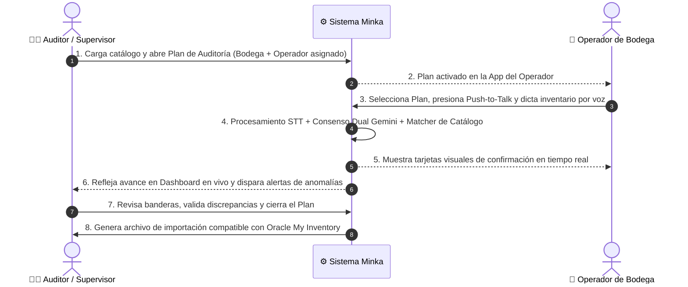
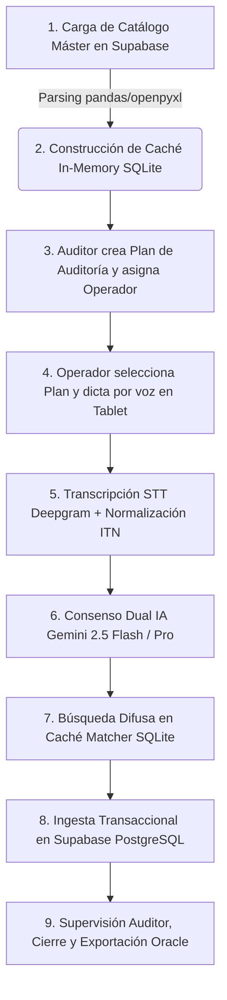

# 🎙️ Minka — Voice Inventory Counter
> **Hackathon Colsubsidio x 30X · Reto de Hospitalidad (Julio 2026)**  
> *Transformando el conteo físico de inventario en restaurantes y hoteles: de lápiz, papel y digitación manual a captura por voz ultra-rápida, validación por consenso triple de Inteligencia Artificial y exportación directa compatible con Oracle My Inventory.*

---

[](https://fastapi.tiangolo.com/)
[](https://astro.build/)
[](https://cloud.google.com/vertex-ai)
[](https://supabase.com/)
[](https://www.sqlite.org/)
[](https://deepgram.com/)
[](https://www.docker.com/)

---

## 📋 Tabla de Contenidos

- [💡 Visión General y Propósito del Proyecto](#-visión-general-y-propósito-del-proyecto)
- [👥 Equipo de Desarrollo](#-equipo-de-desarrollo)
- [🎭 Roles de la Operación y Flujo de Trabajo](#-roles-de-la-operación-y-flujo-de-trabajo)
- [🔄 El Flujo Operativo End-to-End](#-el-flujo-operativo-end-to-end)
- [📱 Flujos de Pantallas e Interacción de Usuarios (UI/UX)](#-flujos-de-pantallas-e-interacción-de-usuarios-uiux)
  - [1. Plataforma del Auditor / Supervisor (`/auditor`) — Apertura, Monitoreo y Cierre](#1-plataforma-del-auditor--supervisor-auditor--apertura-monitoreo-y-cierre)
  - [2. App del Operador (`/conteo`) — Captura por Voz en Bodega](#2-app-del-operador-conteo--captura-por-voz-en-bodega)
- [🗄️ Arquitectura Híbrida de Base de Datos: SQLite + Supabase PostgreSQL](#️-arquitectura-híbrida-de-base-de-datos-sqlite--supabase-postgresql)
- [🏗️ Arquitectura de Microservicios Backend](#️-arquitectura-de-microservicios-backend)
- [🛠️ Tecnologías y Herramientas Utilizadas](#-tecnologías-y-herramientas-utilizadas)
- [📁 Estructura Completa del Repositorio](#-estructura-completa-del-repositorio)
- [📊 Suite Diagnóstica y Resultados del Benchmark ($N=1,904$)](#-suite-diagnóstica-y-resultados-del-benchmark-n1904)
- [⚡ Guía de Instalación y Despliegue Paso a Paso](#-guía-de-instalación-y-despliegue-paso-a-paso)
- [🧪 Estrategia de Pruebas y TDD](#-estrategia-de-pruebas-y-tdd)
- [🔒 Privacidad, Seguridad y Cumplimiento Normativo (Ley 1581 / ISO 27001)](#-privacidad-seguridad-y-cumplimiento-normativo-ley-1581--iso-27001)
- [📚 Documentación Adicional y Fuentes](#-documentación-adicional-y-fuentes)
- [📜 Licencia y Estado](#-licencia-y-estado)

---

## 💡 Visión General y Propósito del Proyecto

En la operación de hoteles, restaurantes y centros de convenciones de Colsubsidio, la toma física de inventario de materia prima (alimentos, bebidas y suministros) ha sido históricamente un proceso crítico pero propenso al error humano:

```
❌ FLUJO TRADICIONAL (Lento e ineficiente):
[Operador cuenta en bodega] ➔ [Anota a lápiz en papel] ➔ [Digitalizador re-digita en plantilla] ➔ [Carga a ERP Oracle] ➔ [Auditor detecta errores y re-cuenta]
```

**Minka** es la solución tecnológica diseñada para el **Reto de Hospitalidad de la Hackathon Colsubsidio x 30X**. Elimina el uso del papel y la redundancia de digitación, introduciendo una aplicación móvil y web con botón *Push-to-Talk* que permite dictar el inventario de manera natural.

```
✅ FLUJO MINKA (Ultra-rápido y validado):
[Auditor abre Plan de Auditoría] ➔ [Operador dicta por voz en Tablet] ➔ [Consenso Dual IA Gemini + Matcher] ➔ [Supervisión & Cierre Auditor] ➔ [Exportación Oracle]
```

> **📌 Principio Clave:** Minka **NO reemplaza el ERP Oracle My Inventory**, sino que le suministra datos limpios, validados y auditables a la primera (*Right First Time*), reduciendo el tiempo de toma de inventario en más de un 70%.

---

## 👥 Equipo de Desarrollo

| Rol | Integrantes | Enfoque Principal |
|---|---|---|
| **Implementación Técnica y Arquitectura** | **Braejan David Arias Heregua**<br>**Daniel Rosas** | Microservicios FastAPI, motores de IA Vertex/Gemini, STT Deepgram, matcher vectorial SQLite, persistencia Supabase, frontend Astro/Preact y suite de benchmarks. |
| **Documentación, Casos de Uso y QA** | **Adriana Durand**<br>**Edith Lavado** | Definición del PRD, diseño de casos de uso de negocio, dataset de pruebas de voz real y aseguramiento de calidad. |
| **Sponsor / Host del Desafío** | **30X · Colsubsidio** | Definición del reto de hospitalidad y validación de reglas de negocio. |

*Para consultar la especificación detallada de requerimientos, revisa el [PRD v1.0](docs/prd.md).*

---

## 🎭 Roles de la Operación y Flujo de Trabajo

El sistema contempla **dos roles claramente diferenciados** que garantizan el control operativo, la segregación de funciones y la auditoría a ciegas (*blind counting*):



### 👨‍💼 Rol 1: Auditor / Supervisor (Plataforma Web `/auditor`)
Es la autoridad responsable de la gobernanza del inventario y la interacción con el ERP Oracle:
- **Paso A: Apertura del Plan**: Crea el **Plan de Auditoría** asignando la bodega específica a auditar (ej. *Bodega de Cocina Principal*), definiendo el período y autorizando explícitamente a los operadores responsables.
- **Paso B: Monitoreo en Tiempo Real**: Visualiza el tablero de control (*Dashboard*) conforme los operadores avanzan dictando en las bodegas.
- **Paso C: Gestión de Anomalías**: Recibe alertas preventivas automáticas (ej: cantidades atípicas frente al histórico, unidades no homologadas o stock que generaría saldos negativos).
- **Paso D: Cierre y Exportación ERP**: Aprueba la reconciliación final y exporta el archivo plano con el formato exacto requerido por **Oracle My Inventory** (*Import Count Sequences*).

### 📱 Rol 2: Operador / Auxiliar de Bodega (App Móvil/Tablet `/conteo`)
Es la persona encargada del conteo físico directo en el punto de almacenamiento:
- **Paso 1: Selección de Plan**: Al ingresar a su tablet o smartphone, visualiza **únicamente los Planes de Auditoría activos que le han sido asignados** por el Auditor.
- **Paso 2: Dictado por Voz (*Push-to-Talk*)**: Presiona el botón del micrófono y dicta naturalmente los productos y cantidades.
- **Paso 3: Validación Visual a Ciegas (*Blind Counting*)**: El operador ve el resultado extraído por la IA (*"Arroz Blanco - 150 Kg"*), pero **por regla de negocio nunca ve el stock teórico del ERP** para evitar sesgos o manipulación de datos.
- **Paso 4: Corrección Inmediata**: Si se equivoca o el sistema detecta una discrepancia de dictado, elimina la tarjeta visual localmente y vuelve a dictar (la voz por seguridad RNF-04 **nunca** modifica ni borra registros cerrados en la base maestra).

---

## 🔄 El Flujo Operativo End-to-End



1. **Configuración del Catálogo**: Ingesta del archivo maestro `BODEGAS Y STOCK.xlsx` en Supabase PostgreSQL y sincronización de la caché in-memory SQLite (`bodegas-y-stock.sqlite`).
2. **Creación del Plan de Auditoría (Auditor, Web `/auditor`)**: Selección de la bodega a auditar, rango de fechas y asignación de operadores autorizados.
3. **Toma de Conteo por Voz (Operador, Tablet `/conteo`)**: El operador selecciona su plan asignado, presiona *Push-to-Talk* y dicta de forma espontánea: *"150 kilos de arroz blanco y 20 litros de aceite de girasol"*.
4. **Extracción Estructurada por IA**:
   - **STT**: Transcripción de audio a texto y Normalización Inversa de Texto (ITN).
   - **Consenso Dual LLM**: Dos modelos en paralelo (Gemini 2.5 Flash y Gemini Pro en Google Vertex AI) evalúan el dictado y generan la estructura JSON `{producto, cantidad, unidad, bodega}`.
5. **Matching de Catálogo ultrarrápido**: Consulta sobre la caché SQLite in-memory (latencia < 6 ms) para asociar el término hablado con el SKU exacto de la bodega.
6. **Validación de Reglas de Negocio y Persistencia en Supabase**: Registro en las tablas transaccionales de Supabase. Si hay anomalías (cantidades fuera de rango histórico), se dispara una bandera de alerta.
7. **Revisión y Cierre (Auditor, Web `/auditor`)**: El auditor revisa las discrepancias notificadas en su tablero y aprueba el cierre del plan.
8. **Exportación ERP**: Generación de archivo plano en formato **Oracle My Inventory** (*Import Count Sequences*), acompañado de un log de auditoría trazable ISO 27001.

---

## 📱 Flujos de Pantallas e Interacción de Usuarios (UI/UX)

La aplicación fue desarrollada en **Astro + Preact + TypeScript** con un diseño moderno, responsivo y adaptado a las condiciones de trabajo en bodegas y cocinas.

### 1. Plataforma del Auditor / Supervisor (`/auditor`) — Apertura, Monitoreo y Cierre
- **Diseñada para**: Tablets en orientación horizontal (1194×834) y computadores de escritorio.
- **Vistas y Módulos**:
  1. **Gestor de Planes de Auditoría**: Formulario interactivo para seleccionar la bodega objetivo, definir fechas y asignar operarios autorizados.
  2. **Dashboard de Supervisión en Vivo**: Muestra el avance del conteo en tiempo real por bodega, porcentaje de SKUs cubiertos y métricas de discrepancias.
  3. **Módulo de Detección de Anomalías**: Panel de control donde el auditor puede auditar registros marcados con bandera naranja, revisar divergencias y conciliar el stock.
  4. **Generador de Exportación Oracle**: Generación en 1-clic del archivo final listo para carga masiva en el ERP de Colsubsidio.

### 2. App del Operador (`/conteo`) — Captura por Voz en Bodega
- **Diseñada para**: Dispositivos móviles y tablets en formato vertical (resolución objetivo 390×844).
- **Vistas y Módulos**:
  1. **Selector de Planes Asignados**: El operador visualiza únicamente los planes activos creados previamente por su auditor.
  2. **Mic Dock (Push-to-Talk)**: Botón táctil gigante que se mantiene presionado mientras se dicta el inventario.
     - **Seguridad**: Auto-stop a los 20 segundos o máximo 1 MB por clip de audio.
     - **Formato Nativo**: Captura directa Opus (`audio/ogg` en Firefox, `audio/webm` en Chrome).
  3. **Tarjetas de Confirmación Visual**: Muestra el desglose de productos identificados por la IA en tiempo real. Permite al operador descartar e ingresar un nuevo dictado si existió una imprecisión.

---

## 🗄️ Arquitectura Híbrida de Base de Datos: SQLite + Supabase PostgreSQL

Para resolver el desafío técnico de **rendimiento en tiempo real (< 5 ms)** sin sacrificar **gobernanza de datos persistente, seguridad RLS y trazabilidad de auditoría**, Minka implementa una **arquitectura híbrida de base de datos en dos capas**:

```
+---------------------------------------------------------------------------------------------------+
|                                CAPA PERSISTENTE (SUPABASE POSTGRESQL)                              |
| - Persistencia Nube de Usuarios y Roles (`profiles`)                                              |
| - Gestión de Planes de Auditoría (`audit_plans`) y Asignación de Operadores (`audit_plan_operators`)|
| - Ingesta Transaccional de Conteo (`count_sessions` e `inventory_records`)                         |
| - Motor de Anomalías, Reconciliaciones Aprobadas (`audit_reconciliations`) e Histórico Oracle     |
| - Seguridad de Acceso con Row Level Security (RLS) para Conteo a Ciegas                            |
+---------------------------------------------------------------------------------------------------+
                                                 |
                                 Sincronización de Catálogo Máster
                                                 v
+---------------------------------------------------------------------------------------------------+
|                                   CAPA CACHÉ LOCAL (SQLITE IN-MEMORY)                             |
| - Residencia local in-memory en el Microservicio `matcher` (`data/bodegas-y-stock.sqlite`)         |
| - Indexación Vectorial Trigram + RapidFuzz para Matching de SKUs a partir de la voz               |
| - Latencia ultrarrápida de búsqueda: 2 ms - 6 ms                                                 |
| - Montada como volumen de solo lectura (`mode=ro`)                                                |
+---------------------------------------------------------------------------------------------------+
```

---

## 🏗️ Arquitectura de Microservicios Backend

El sistema se compone de **4 microservicios independientes** desacoplados, desplegados mediante un único archivo `docker-compose.yml`:

```
                           +-------------------------------+
                           |      Cliente Tablet / Web     |
                           |   Astro + Preact (Puerto 4321)|
                           +---------------+---------------+
                                           |
                                    (Proxy HTTP API)
                                           |
        +----------------------------------+----------------------------------+
        |                                  |                                  |
        v                                  v                                  v
+---------------+                  +---------------+                  +---------------+
| Microservicio |                  | Microservicio |                  | Microservicio |
|    STT        |                  | Extractor IA  |                  |    Matcher    |
| (Puerto 8001) |                  | (Puerto 8003) |                  | (Puerto 8002) |
+-------+-------+                  +-------+-------+                  +-------+-------+
        |                                  |                                  |
        v                                  v                                  v
  Deepgram API                     Vertex AI / Gemini                   Caché SQLite /
 (Audio a Texto)                 (Consenso Dual LLM)                 Supabase PostgreSQL
```

### Descripción de los Microservicios

1. **Frontend Proxy (`frontend`) — Puerto 4321**:
   - Desarrollado en Astro con SSR en Node.js.
   - Proxy de peticiones a los microservicios backend para evitar problemas de CORS y aislar las APIs internas.

2. **Servicio Speech-to-Text (`services/stt`) — Puerto 8001**:
   - API en FastAPI encargada de transformar la voz en texto.
   - **Jerarquía Multi-Proveedor**: Deepgram Nova-2 (Principal) $\rightarrow$ ElevenLabs (Reserva) $\rightarrow$ Groq Whisper (Fallback).
   - **RNF-04**: El audio jamás se almacena en disco.

3. **Servicio de Extracción por IA (`services/product_identification`) — Puerto 8003**:
   - API en FastAPI con integración a Google Vertex AI.
   - Consenso dual entre **Gemini 2.5 Flash** y **Gemini Pro** para estructurar el texto dictado en esquemas JSON estandarizados.

4. **Servicio Matcher de Catálogo (`services/matcher`) — Puerto 8002**:
   - Engine de búsqueda difusa sobre la caché SQLite (`bodegas-y-stock.sqlite`).
   - Algoritmo **RapidFuzz** + **Scoring por Trigramas** con latencia promedio de **6.38 ms**.

---

## 🛠️ Tecnologías y Herramientas Utilizadas

| Capa | Tecnología / Herramienta | Razón de Elección |
|---|---|---|
| **Lenguaje Backend** | Python 3.11+ (gestionado con `uv`) | Rendimiento asíncrono y gestión eficiente de dependencias. |
| **Framework APIs** | FastAPI + Uvicorn | Alta velocidad y documentación interactiva OpenAPI automática. |
| **Frontend UI** | Astro 4 + Preact + TypeScript | Carga ultrarrápida, arquitectura de islas e interfaz responsiva. |
| **Base de Datos Persistente** | Supabase (PostgreSQL Cloud) | Gobernanza relacional, gestión de usuarios/roles y seguridad RLS. |
| **Base de Datos Caché** | SQLite 3 (`pandas` + `openpyxl`) | Caché in-memory ultrarrápida (latencia < 6ms) montada en modo solo lectura (`mode=ro`). |
| **Motor STT** | Deepgram API (Nova-2) | Latencia sub-segundo (<500 ms) y alta precisión en español. |
| **Modelos de IA** | Google Vertex AI (Gemini 2.5 Flash / Pro) | Consenso estocástico dual para evitar alucinaciones de inventario. |
| **Matching Algorítmico** | RapidFuzz + Trigram Scoring | Búsqueda difusa tolerante a errores ortográficos de transcripción. |
| **Contenedores** | Docker & Docker Compose | Despliegue estandarizado de la arquitectura completa. |

---

## 📁 Estructura Completa del Repositorio

```
colsubsidio30x-minka/
├── .env.example               # Plantilla unificada de variables de entorno (Supabase, Vertex AI, STT)
├── docker-compose.yml         # Superficie única de despliegue Docker
├── Makefile                   # Accesos directos de automatización (build, test, run)
├── pyproject.toml             # Configuración del workspace global uv / Python
├── README.md                  # Puerta de entrada principal del proyecto
│
├── benchmarks/                # 📊 Suite de benchmarking y evaluación diagnóstica
│   ├── benchmark_execution.sqlite # Base de datos con las 1,904 ejecuciones
│   ├── corpus/                # Datasets de audio (238 clips en MP4 y OGG)
│   ├── dashboard/             # Tablero visual interactivo (index.html)
│   ├── docs/                  # Documentación metodológica detallada
│   └── reports/               # CSV consolidado para análisis en Excel
│
├── data/                      # 🗄️ Caché de catálogo SQLite (generado a partir de Excel)
│   └── bodegas-y-stock.sqlite # Base de datos local de 1,405 SKUs (gitignored)
│
├── docs/                      # 📚 Documentación técnica y de diseño
│   ├── prd.md                 # Documento de Requerimientos de Producto (PRD v1.0)
│   ├── deployment.md          # Guía de despliegue y variables de entorno
│   ├── database/              # Arquitectura de datos (Supabase + SQLite ERD)
│   └── diagrams/              # Diagramas Mermaid y flujos de arquitectura
│
├── frontend/                  # 📱 App Web Operador y Auditor (Astro + Preact)
│   ├── src/components/        # Componentes UI (Mic Dock, Auditor Panes, etc.)
│   ├── src/pages/             # Rutas (/conteo, /auditor, APIs de proxy)
│   └── package.json           # Dependencias Node.js
│
├── services/                  # ⚙️ Microservicios Backend en Python
│   ├── matcher/               # Módulo 3: Búsqueda difusa en catálogo (Puerto 8002)
│   ├── product_identification/ # Módulo 2: Extracción estructurada IA (Puerto 8003)
│   └── stt/                   # Módulo 1: Transcripción de voz STT (Puerto 8001)
│
├── scripts/                   # 🛠️ Scripts auxiliares
│   ├── build-sqlite.py        # Conversor de BODEGAS Y STOCK.xlsx a SQLite
│   ├── ingest_drive_dataset.py # Ingesta automática del dataset desde Google Drive
│   └── setup-env.sh           # Asistente interactivo de configuración .env
│
└── tests/                     # 🧪 Suite de pruebas integradas y de contrato
    ├── deployment/            # Pruebas de contrato de docker-compose y .env
    └── product_identification/ # Pruebas unitarias del extractor Gemini
```

---

## 📊 Suite Diagnóstica y Resultados del Benchmark ($N=1,904$)

Para demostrar la validez de Minka ante los jueces con **rigor científico y datos reales**, se construyó una suite de pruebas diagnósticas con audios grabados en campo por el equipo (*Adriana* y *Daniel*).

### 1. El Corpus de Pruebas Real en Google Drive
- **238 notas de voz reales** (133 clips de Adriana en `.mp4` + 105 clips de Daniel en `.ogg`).
- **4 Niveles de Dificultad Evaluados**:
  - 🟢 **Fácil**: Dictado directo de producto y cantidad (*"150 KILOS DE ARROZ"*).
  - 🟡 **Medio**: Dictado con contexto conversacional (*"Hola Carlos, en la bodega hay 90 kilos de lenteja"*).
  - 🔴 **Difícil**: Grabaciones con ruido de fondo de cocinas y extractores.
  - ⚪ **Garbage / Omitir**: Conversaciones cotidianas o ruido sin datos de inventario (verificación de cero alucinaciones).

> 🔗 **Acceso Público a Recursos de Benchmark**:
> - 📂 [Carpeta Compartida de Audios en Google Drive](https://drive.google.com/drive/u/1/folders/1e9a69v6Fz5m8o6XWsStagUtJKu-Hnuau)
> - 📊 [Hoja de Datos Adriana (BD_AUDIOS)](https://docs.google.com/spreadsheets/d/1UcAYiDXcqzjST9mM9x-Y9pZC142KsRl73PuG6677WaM)
> - 📊 [Hoja de Datos Daniel (BD_AUDIOS)](https://docs.google.com/spreadsheets/d/1nzou21xzFw4y5Npk0NJujcfwRGfPJsOWgYyfol2-oas)

### 2. Resultados Consolidados (8 Corridas Paralelas, $N = 1,904$ Evaluaciones en Vivo)

Debido a que los modelos de lenguaje son estocásticos, el benchmark ejecutó **8 corridas completas en paralelo** ($238 \text{ casos} \times 8 = 1,904 \text{ evaluaciones en vivo}$):

| Paso Diagnóstico | Latencia Promedio | Métrica Clave de Desempeño | Costo Total (1,904 Audios) | Costo por Nota de Voz |
|---|---|---|---|---|
| 🎙️ **Paso 1: STT (Deepgram)** | **437.45 ms** | Precisión de Dígitos: **100.0%** (WER ultra bajo) | $1.4440 USD | $0.00075 USD |
| 🤖 **Paso 2: Extractor IA (Gemini)** | **4,333.91 ms** | Tasa de Consenso Dual: **97.8%** | $0.0871 USD | $0.00004 USD |
| 🗄️ **Paso 3: Matcher (SQLite)** | **6.38 ms** | Coincidencia de Catálogo Exacta | $0.0000 USD | $0.00000 USD |
| ⚡ **FLUJO COMPLETO END-TO-END** | **4,777.96 ms** | **Éxito Operativo Global** | **$1.5310 USD** | **$0.00080 USD** |

### 3. Visualización del Dashboard
El repositorio incluye un tablero estático HTML interactivo para inspeccionar los resultados:
- **Ruta local**: [`benchmarks/dashboard/index.html`](benchmarks/dashboard/index.html) (Abrir directamente en el navegador).
- **Reporte CSV para Excel**: [`benchmarks/reports/reporte_completo_para_excel.csv`](benchmarks/reports/reporte_completo_para_excel.csv).

---

## ⚡ Guía de Instalación y Despliegue Paso a Paso

### Requisitos Previos
- **Docker Engine** 24.0+ y **Docker Compose** v2.20+.
- **Python 3.11+** y el gestor de paquetes [`uv`](https://docs.astral.sh/uv/) (para desarrollo local fuera de Docker).
- **Node.js** 18+ y `npm` (para desarrollo local del frontend).

### Paso 1: Clonar el Repositorio y Configurar Entorno
```bash
git clone https://github.com/tu-usuario/colsubsidio30x-minka.git
cd colsubsidio30x-minka

# Configurar el archivo .env interactivo (valida credenciales de Deepgram, Supabase y GCP Vertex AI)
./scripts/setup-env.sh
```

### Paso 2: Construir la Caché Local del Catálogo
Genera la base SQLite compilada a partir del catálogo maestro Excel:
```bash
make build-sqlite
# O alternativamente:
uv run python scripts/build-sqlite.py
```

### Paso 3: Desplegar con Docker Compose
Inicia los 4 microservicios en segundo plano:
```bash
docker compose up -d --build
```

### Paso 4: Verificar la Salud de los Servicios (*Health Checks*)
```bash
# Estado de los contenedores
docker compose ps

# Pruebas de respuesta HTTP por microservicio:
curl http://localhost:8001/health   # 🎙️ STT Service
curl http://localhost:8002/health   # 🗄️ Matcher Service
curl http://localhost:8003/health   # 🤖 Product Identification AI Engine
curl http://localhost:4321/health   # 📱 Frontend Application
```

### URLs de Acceso en el Navegador
- 💻 **Plataforma del Auditor / Supervisor** (Apertura de Plan & Cierre ERP): `http://localhost:4321/auditor`
- 📱 **App del Operador** (Conteo por Voz en Bodega): `http://localhost:4321/conteo`

> ⚠️ **Nota de Seguridad del Navegador:** El uso del micrófono (`getUserMedia`) exige un entorno seguro (**HTTPS** o **`localhost`**). Para pruebas de demostración, abre el navegador directamente en el equipo donde se ejecutan los servicios.

---

## 🧪 Estrategia de Pruebas y TDD

El proyecto fue construido bajo la metodología **TDD (Test-Driven Development)** estricta, garantizando que ninguna actualización rompa contratos de integración ni la estabilidad del sistema.

### Comandos de Ejecución de Pruebas

```bash
# 1. Suite general de pruebas unitarias y de API en Python
uv run pytest

# 2. Pruebas de contrato de despliegue Docker y variables de entorno
uv run pytest tests/deployment

# 3. Pruebas unitarias y de componentes del Frontend (Vitest)
cd frontend && npx vitest run

# 4. Verificación de tipos TypeScript en el Frontend
cd frontend && npx astro check
```

---

## 🔒 Privacidad, Seguridad y Cumplimiento Normativo (Ley 1581 / ISO 27001)

1. **Cero Retención de Audio (RNF-04)**:
   - Para mitigar riesgos de suplantación de voz y cumplir con estándares de ciberseguridad, los clips de audio **nunca se almacenan en disco**. Se procesan en streaming en la memoria RAM y se descartan inmediatamente tras obtener la transcripción.
2. **Protección de Datos Personales (Ley 1581 de Colombia)**:
   - Los registros de log (*telemetría*) excluyen cualquier texto transcrito o nombre de producto que pudiera contener información sensible en nivel `INFO`.
3. **Inmutabilidad de la Caché**:
   - La base de datos `bodegas-y-stock.sqlite` se monta en volumen de Docker como solo lectura (`:ro`) y se abre con la bandera `mode=ro` en SQLite.
4. **Marco de Seguridad ISO 27001 y RLS**:
   - Trazabilidad completa de operaciones con Row Level Security (RLS) en Supabase para garantizar que cada operador solo acceda a los planes asignados a su cuenta.

---

## 📚 Documentación Adicional y Fuentes

Para profundizar en los detalles arquitectónicos y decisiones de diseño del proyecto, consulta la documentación interna:

- 📄 [Documento de Requerimientos de Producto (PRD v1.0)](docs/prd.md)
- 📝 [Extracción Trazable de la Sesión de Descubrimiento](docs/prd-seed.md)
- 📊 [Metodología de Benchmarking y Dataset Tecnológico](benchmarks/docs/metodologia_y_dataset.md)
- 🗄️ [Arquitectura de Base de Datos (Supabase + SQLite)](docs/database/DATABASE_ARCHITECTURE.md)
- 🚀 [Checklist de Despliegue de Entorno Único](docs/deployment.md)

---

## 📜 Licencia y Estado

- **Estado del Proyecto**: MVP de Hackathon — Listo para Evaluación de Jurados.
- **Licencia**: Propiedad exclusiva del equipo desarrollador y organizaciones aliadas del desafío (**Colsubsidio x 30X**). Prohibida la reproducción no autorizada fuera del marco del evento. Consulta el archivo [`LICENSE`](LICENSE) para más detalles.

---

<p align="center">
  <b>Desarrollado con ❤️ para la Hackathon Colsubsidio x 30X · Julio 2026</b>
</p>
