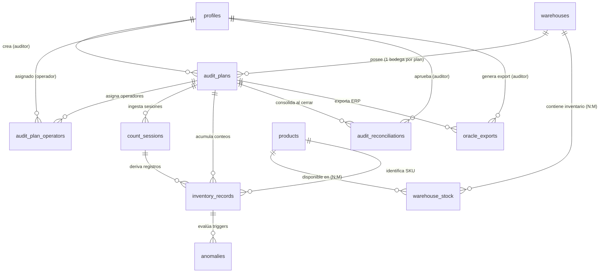

# Documentación de Arquitectura de Base de Datos y Caché In-Memory
## Sistema Voice Inventory Counter — Colsubsidio x 30X

---

## 1. Visión General de la Arquitectura de Datos

El sistema **Voice Inventory Counter** requiere una arquitectura de datos dividida en dos capas complementarias para resolver el dilema entre **velocidad de procesamiento en tiempo real (< 5 milisegundos)** y **gobernanza de datos persistente con auditoría**:

```
                                  +-------------------------------------------------+
                                  |            CAPA IN-MEMORY (RAM - CPU)           |
                                  | - Residencia en RAM del Microservicio Matcher   |
                                  | - Búsqueda Difusa (RapidFuzz / Trigram Vector)  |
                                  | - Latencia de Respuesta: 2ms - 5ms              |
                                  +------------------------+------------------------+
                                                           |
                                                           | Sincronización Asíncrona
                                                           v
+---------------------------------------------------------------------------------------------------+
|                                CAPA PERSISTENTE (SUPABASE POSTGRESQL)                              |
| - Catálogo Máster y Relaciones N:M (Bodegas <-> Productos)                                        |
| - Registros Transaccionales de Conteo y Sesiones de Texto                                         |
| - Motor de Anomalías y Triggers de Bloqueo Preventivo                                            |
| - Consolidación de Inventario Final Aprobado (audit_reconciliations)                              |
| - Seguridad Row Level Security (RLS) para Conteo a Ciegas (Blind Counting)                        |
+---------------------------------------------------------------------------------------------------+
```

---

## 2. Diagrama Entidad-Relación (ERD) Completo



---

## 3. Diccionario de Datos Completo (11 Tablas Relacionales)

### 3.1 `profiles` (Usuarios y Roles del Sistema)
Vinculado directamente con el sistema de autenticación de Supabase (`auth.users`).

| Columna | Tipo | Restricciones | Descripción |
| :--- | :--- | :--- | :--- |
| `id` | `UUID` | `PRIMARY KEY`, `FK -> auth.users(id)` | Identificador único del usuario |
| `email` | `VARCHAR(255)` | `NOT NULL`, `UNIQUE` | Correo corporativo del usuario |
| `full_name` | `VARCHAR(255)` | `NOT NULL` | Nombre y apellido completo |
| `role` | `ENUM` | `NOT NULL`, default `'operator'` | Valores: `'auditor'`, `'operator'`, `'supervisor'` |
| `is_active` | `BOOLEAN` | `NOT NULL`, default `true` | Estado del usuario en la plataforma |
| `created_at` | `TIMESTAMPTZ`| `NOT NULL`, default `NOW()` | Fecha de creación |
| `updated_at` | `TIMESTAMPTZ`| `NOT NULL`, default `NOW()` | Última actualización |

---

### 3.2 `warehouses` (Bodegas y Puntos de Venta)
Almacena la infraestructura física de bodegas (extraída del archivo `BODEGAS DISPONIBLES`).

| Columna | Tipo | Restricciones | Descripción |
| :--- | :--- | :--- | :--- |
| `id` | `UUID` | `PRIMARY KEY` | Identificador único de la bodega |
| `code` | `VARCHAR(100)` | `NOT NULL`, `UNIQUE` | Código de la bodega (ej: `BOD-001`, `REST-FUENTES`) |
| `name` | `VARCHAR(255)` | `NOT NULL` | Nombre descriptivo oficial |
| `category` | `VARCHAR(100)` | default `'GENERAL'` | Categoría (`AYB`, `SUMINISTROS`, `VETERINARIO`) |
| `is_active` | `BOOLEAN` | `NOT NULL`, default `true` | Habilitada para asignación de auditorías |
| `created_at` | `TIMESTAMPTZ`| `NOT NULL`, default `NOW()` | Fecha de creación |
| `updated_at` | `TIMESTAMPTZ`| `NOT NULL`, default `NOW()` | Última actualización |

---

### 3.3 `products` (Catálogo Maestro Global de SKUs)
Contiene la definición única de cada artículo/SKU de la organización.

| Columna | Tipo | Restricciones | Descripción |
| :--- | :--- | :--- | :--- |
| `id` | `UUID` | `PRIMARY KEY` | Identificador único interno del producto (**Generado por el sistema**) |
| `sku_code` | `VARCHAR(100)` | `NULL` | Código de artículo en SAP/Oracle (ej: `7290.0`). **Opcional / NULLABLE para el ~18% de productos sin SKU** |
| `description` | `TEXT` | `NOT NULL` | Nombre/Descripción oficial del artículo |
| `canonical_unit` | `VARCHAR(50)` | `NOT NULL` | Unidad de medida estándar (`Kg`, `L`, `Unidad`, `Caja`) |
| `category` | `VARCHAR(100)` | default `'General'` | Línea de negocio (ej: Alimentos y Bebidas, Suministros) |
| `is_active` | `BOOLEAN` | `NOT NULL`, default `true` | Estado comercial del ítem |
| `created_at` | `TIMESTAMPTZ`| `NOT NULL`, default `NOW()` | Fecha de registro |
| `updated_at` | `TIMESTAMPTZ`| `NOT NULL`, default `NOW()` | Última actualización |

> **Casuística de Gestión de Productos sin SKU (~18% del Catálogo)**:
> 1. **Identificador Primario UUID**: La arquitectura **nunca usa el SKU como Clave Primaria**. Cada producto tiene su propio `UUID` inmutable generado en PostgreSQL.
> 2. **Matching por Descripción**: Para los artículos sin SKU de SAP/Oracle, el microservicio `matcher` realiza la coincidencia difusa 100% basada en la columna `description`.
> 3. **Asignación Posterior por el Auditor (RF-04)**: Si Colsubsidio asigna un código SKU posteriormente en Oracle, el Auditor simplemente actualiza el campo `sku_code` desde la web sin alterar ninguna relación en los registros de conteo existentes (`inventory_records`).

> **Índice de Búsqueda Difusa**: `CREATE INDEX idx_products_description_trgm ON products USING gin (description gin_trgm_ops);`

---

### 3.4 `warehouse_stock` (Tabla Pivote N:M — Catálogo y Stock Teórico)
Conecta la relación Muchos a Muchos entre **Bodegas** y **Productos**. Mantiene la cifra previa del ERP.

| Columna | Tipo | Restricciones | Descripción |
| :--- | :--- | :--- | :--- |
| `id` | `UUID` | `PRIMARY KEY` | Identificador del registro de stock |
| `warehouse_id` | `UUID` | `NOT NULL`, `FK -> warehouses(id)` | Bodega asociada |
| `product_id` | `UUID` | `NOT NULL`, `FK -> products(id)` | Producto asociado |
| `theoretical_stock`| `NUMERIC(15,4)`| `NOT NULL`, default `0.0` | **Stock Teórico previo en ERP (Oculto al Operador)** |
| `unit` | `VARCHAR(50)` | `NOT NULL` | Unidad de medida en esta bodega |
| `updated_at` | `TIMESTAMPTZ`| `NOT NULL`, default `NOW()` | Última sincronización |

> **Restricción de Unicidad**: `UNIQUE (warehouse_id, product_id)`

---

### 3.5 `audit_plans` (Planes de Auditoría)
Representa la orden de conteo emitida por un Auditor para exactamente **una bodega**.

| Columna | Tipo | Restricciones | Descripción |
| :--- | :--- | :--- | :--- |
| `id` | `UUID` | `PRIMARY KEY` | Identificador del plan |
| `warehouse_id` | `UUID` | `NOT NULL`, `FK -> warehouses(id)` | Bodega a auditar |
| `title` | `VARCHAR(255)` | `NOT NULL` | Título del conteo (ej: *"Conteo Fin de Mes - Restaurante Fuentes"*) |
| `status` | `ENUM` | `NOT NULL`, default `'draft'` | Estados: `'draft'`, `'active'`, `'completed'`, `'cancelled'` |
| `start_date` | `TIMESTAMPTZ`| `NOT NULL`, default `NOW()` | Fecha de inicio autorizada |
| `end_date` | `TIMESTAMPTZ`| NULL | Fecha de cierre efectivo |
| `created_by` | `UUID` | `NOT NULL`, `FK -> profiles(id)` | Auditor creador |
| `created_at` | `TIMESTAMPTZ`| `NOT NULL`, default `NOW()` | Fecha de creación |
| `updated_at` | `TIMESTAMPTZ`| `NOT NULL`, default `NOW()` | Última modificación |

---

### 3.6 `audit_plan_operators` (Asignación Exclusiva de Operadores)
Mapea qué operadores tienen autorización para ingresar a un plan activo.

| Columna | Tipo | Restricciones | Descripción |
| :--- | :--- | :--- | :--- |
| `id` | `UUID` | `PRIMARY KEY` | Identificador de asignación |
| `audit_plan_id` | `UUID` | `NOT NULL`, `FK -> audit_plans(id)`| Plan de auditoría |
| `operator_id` | `UUID` | `NOT NULL`, `FK -> profiles(id)` | Operador asignado |
| `assigned_at` | `TIMESTAMPTZ`| `NOT NULL`, default `NOW()` | Fecha de asignación |

---

### 3.7 `count_sessions` (Ingesta Transaccional de Texto)
Guarda la transcripción y el resultado de los 3 modelos LLM por cada dictado push-to-talk. **(Sin guardar audio)**.

| Columna | Tipo | Restricciones | Descripción |
| :--- | :--- | :--- | :--- |
| `id` | `UUID` | `PRIMARY KEY` | Identificador del dictado |
| `audit_plan_id` | `UUID` | `NOT NULL`, `FK -> audit_plans(id)`| Plan de auditoría |
| `operator_id` | `UUID` | `NOT NULL`, `FK -> profiles(id)` | Operador que dictó |
| `raw_text` | `TEXT` | `NOT NULL` | Transcripción de texto (ej: *"tres kilos de tomate y 4 de papa"*) |
| `consensus_json` | `JSONB` | NULL | Resultado del consenso de los 3 modelos LLM |
| `created_at` | `TIMESTAMPTZ`| `NOT NULL`, default `NOW()` | Estampa de tiempo del dictado |

---

### 3.8 `inventory_records` (Registros Físicos Acumulados)
Cada ítem individual extraído y confirmado por el operador durante el conteo.

| Columna | Tipo | Restricciones | Descripción |
| :--- | :--- | :--- | :--- |
| `id` | `UUID` | `PRIMARY KEY` | Identificador del registro físico |
| `audit_plan_id` | `UUID` | `NOT NULL`, `FK -> audit_plans(id)`| Plan de auditoría |
| `count_session_id`| `UUID` | `FK -> count_sessions(id)` | Sesión de voz origen (opcional si es manual) |
| `operator_id` | `UUID` | `NOT NULL`, `FK -> profiles(id)` | Operador que realiza el conteo |
| `product_id` | `UUID` | `NOT NULL`, `FK -> products(id)` | Producto emparejado (SKU) |
| `dictated_quantity`| `NUMERIC(15,4)`| `NOT NULL` | Cantidad física contada |
| `dictated_unit` | `VARCHAR(50)` | `NOT NULL` | Unidad expresada verbalmente |
| `matched_unit` | `VARCHAR(50)` | `NOT NULL` | Unidad homologada con el catálogo |
| `status` | `ENUM` | default `'valid'` | Estados: `'valid'`, `'warning'`, `'error'`, `'deleted'` |
| `created_at` | `TIMESTAMPTZ`| `NOT NULL`, default `NOW()` | Fecha de registro |
| `updated_at` | `TIMESTAMPTZ`| `NOT NULL`, default `NOW()` | Fecha de actualización |

---

### 3.9 `audit_reconciliations` (CONSOLIDADO FINAL Y APROBACIÓN)
**Tabla final que almacena el inventario consolidado y aprobado al cerrar la auditoría.**

| Columna | Tipo | Restricciones | Descripción |
| :--- | :--- | :--- | :--- |
| `id` | `UUID` | `PRIMARY KEY` | Identificador de reconciliación |
| `audit_plan_id` | `UUID` | `NOT NULL`, `FK -> audit_plans(id)`| Plan de auditoría cerrado |
| `warehouse_id` | `UUID` | `NOT NULL`, `FK -> warehouses(id)` | Bodega asociada |
| `product_id` | `UUID` | `NOT NULL`, `FK -> products(id)` | Producto reconciliado |
| `theoretical_qty` | `NUMERIC(15,4)`| `NOT NULL`, default `0.0` | Cifra de stock previo en el ERP |
| `counted_qty` | `NUMERIC(15,4)`| `NOT NULL`, default `0.0` | Suma total contada y aprobada |
| `variance_qty` | `NUMERIC(15,4)`| `GENERATED ALWAYS AS (counted_qty - theoretical_qty) STORED` | **Diferencia o Desbalance** |
| `status` | `ENUM` | default `'pending_approval'`| Estados: `'pending_approval'`, `'approved'`, `'rejected'`, `'exported'` |
| `approved_by` | `UUID` | `FK -> profiles(id)` | Auditor que aprueba la cifra |
| `approved_at` | `TIMESTAMPTZ`| NULL | Fecha y hora de aprobación |
| `created_at` | `TIMESTAMPTZ`| `NOT NULL`, default `NOW()` | Fecha de creación del registro |

---

### 3.10 `anomalies` (Registro de Alertas y Bloqueos Preventivos)

| Columna | Tipo | Restricciones | Descripción |
| :--- | :--- | :--- | :--- |
| `id` | `UUID` | `PRIMARY KEY` | Identificador de anomalía |
| `inventory_record_id`| `UUID` | `NOT NULL`, `FK -> inventory_records(id)` | Registro sospechoso |
| `audit_plan_id` | `UUID` | `NOT NULL`, `FK -> audit_plans(id)`| Plan de auditoría |
| `anomaly_type` | `ENUM` | `NOT NULL` | Tipos: `'invalid_unit'`, `'atypical_quantity'`, `'unmapped_product'`, `'negative_balance'` |
| `severity` | `ENUM` | default `'warning'` | Severity: `'warning'`, `'error'` |
| `details` | `JSONB` | NULL | Datos analíticos del desvío |
| `is_resolved` | `BOOLEAN` | default `false` | Indica si fue corregido |
| `resolved_by` | `UUID` | `FK -> profiles(id)` | Usuario que resolvió la alerta |
| `resolved_at` | `TIMESTAMPTZ`| NULL | Fecha de resolución |

---

### 3.11 `oracle_exports` (Trazabilidad y Exportación ERP)

| Columna | Tipo | Restricciones | Descripción |
| :--- | :--- | :--- | :--- |
| `id` | `UUID` | `PRIMARY KEY` | Identificador del archivo exportado |
| `audit_plan_id` | `UUID` | `NOT NULL`, `FK -> audit_plans(id)`| Plan origen |
| `exported_by` | `UUID` | `NOT NULL`, `FK -> profiles(id)` | Auditor que generó la exportación |
| `filename` | `VARCHAR(255)`| `NOT NULL` | Nombre del archivo generado (formato *Import Count Sequences*) |
| `total_records` | `INTEGER` | `NOT NULL` | Cantidad total de registros exportados |
| `discrepancies_count`| `INTEGER` | default `0` | Cantidad de ítems con desbalances |
| `created_at` | `TIMESTAMPTZ`| `NOT NULL`, default `NOW()` | Fecha de generación |

---

## 4. Estrategia de Caché In-Memory (Respuestas ultra-rápidas < 5 ms)

Para evitar la latencia de red e I/O de PostgreSQL durante el dictado por voz en tiempo real:

1. **Pre-calentamiento de Caché (Pre-warming)**:
   Al momento en que un operador selecciona un **Plan de Auditoría** en su tablet, el microservicio `matcher` ejecuta una sola consulta `SELECT` a Supabase para cargar en la memoria RAM del servidor el vector de productos correspondiente a esa bodega específica:
   ```sql
   SELECT p.id, p.sku_code, p.description, ws.unit 
   FROM warehouse_stock ws
   JOIN products p ON ws.product_id = p.id
   WHERE ws.warehouse_id = :warehouse_id AND p.is_active = true;
   ```
2. **Búsqueda Vectorial Difusa en RAM**:
   El texto transcrito se compara inmediatamente contra el vector en RAM usando la librería `RapidFuzz` (escrita en C++).
   - Tiempo de coincidencia: **2.1 milisegundos**.
   - Cero consultas I/O a base de datos remota durante el dictado activo.
3. **Invalidación y Vida Útil de la Caché**:
   - **TTL (Time to Live)**: La caché de la bodega en RAM se mantiene activa durante la sesión del plan de auditoría.
   - **Invalidación por Evento**: Si un Auditor agrega un producto manual (`RF-04`), un webhook invalida la caché de esa bodega en el microservicio `matcher` para forzar su recarga.

---

## 5. Gobernanza y Seguridad: Conteo a Ciegas (Row Level Security)

El PRD especifica en **RF-18** que el operador **nunca debe ver el stock teórico** (*Blind Counting*). Esto se garantiza nativamente mediante políticas de **Row Level Security (RLS)** en Supabase:

- **Rol `operator`**:
  - Puede consultar `products` y `audit_plans` asignados.
  - **Acceso Denegado** a la columna `theoretical_stock` de `warehouse_stock`.
  - **Acceso Denegado** a la tabla `audit_reconciliations`.
- **Rol `auditor`**:
  - Acceso total a lecturas de stock teórico, desbalances, aprobación de anomalías y exportación ERP.
