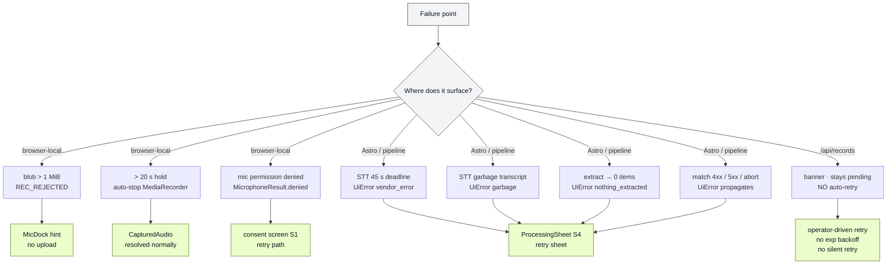

# 03 — Implementation flow (as the code actually runs)

Source: `docs/diagrams/03-implementation-flow.md`
Status: **derived from code**, not from PRD §6.1. Where this diagram and the PRD diverge, the code wins — the PRD reflects the 23 Jul meeting, this file reflects the running system on `main`.
Mirrors: [`01-end-to-end-flow.html`](01-end-to-end-flow.html) (Discovery-era, pre-meeting) · [`../prd.md` §6.1](../prd.md) (agreed flow) · [`../sources/meet-define-project.md`](../sources/meet-define-project.md) (raw transcript).

This file is the answer to the question *"what would actually happen if I pushed the mic right now?"*. It is the artifact used by [`sdd-apply`](../README.md) when the orchestrator needs to know which service to call at which step.

---

## 1 · End-to-end flowchart, swimlanes by runtime

The same flow rendered as a flowchart, swimlanes by runtime container, edges labeled with the artifact that crosses the boundary.

```mermaid
flowchart LR
    %% ────────────── BROWSER ──────────────
    subgraph B[Browser — operator's phone]
        M[MicDock<br/>S3]:::browser
        R[createRecorder<br/>opus ~28 kbps<br/>hard 20 s auto-stop]:::browser
        L[blob &gt; 1 MiB?<br/>REC_REJECTED local]:::browser
        T1[ProcessingSheet<br/>S4 progressive reveal]:::browser
        T2[AnomalySheet<br/>mic BLOCKED]:::browser
        T3[SearchSheet<br/>ambiguous + no_match]:::browser
        T4[ConfirmSheet<br/>combined — all items<br/>structurally blind]:::browser
        P[onConfirm<br/>setState pending<br/>«Pendiente de subir»]:::browser
        E[useEffect<br/>ONE POST /api/records<br/>clientRecordId = rec-at-seq]:::browser
        BANN[banner on failure<br/>NO auto-retry]:::browser
    end

    %% ────────────── ASTRO ──────────────
    subgraph A[Astro · :4321 · same-origin proxy]
        AT[/api/transcribe<br/>proxy forward]:::astro
        AX[/api/extract<br/>proxy forward]:::astro
        AM[/api/match<br/>proxy forward]:::astro
        AA[/api/anomaly-check<br/>in-process engine]:::astro
        AR[/api/records<br/>guard plan → resolve<br/>idempotency → validate<br/>INSERT count_records<br/>best-effort INSERT anomalies]:::astro
    end

    %% ────────────── PYTHON SERVICES ──────────────
    subgraph S[Python services · FastAPI]
        STT[STT :8001<br/>retries → Deepgram<br/>→ Groq / ElevenLabs<br/>one 45 s deadline]:::svc
        EX[product_identification :8003<br/>DualModelInventoryExtractor<br/>dual Gemini parallel]:::svc
        MA[matcher :8002<br/>trigram index in-memory<br/>Redis snapshot lock]:::svc
    end

    %% ────────────── SUPABASE ──────────────
    subgraph DB[(Supabase · Postgres)]
        CR[(count_records<br/>source:voice)]:::db
        PR[(products<br/>name_normalized<br/>sku ~18% NULL)]:::db
        RA[(record_anomalies<br/>best-effort)]:::db
        SB[(stock_balances<br/>never written by /api/records)]:::db
    end

    %% ─── HAPPY-PATH EDGES (browser → services → supabase) ───
    M -- pointerdown/up --> R
    R -- CapturedAudio --> L
    L -- accepted --> T1
    L -- rejected --> M

    T1 -- multipart<br/>POST /api/transcribe --> AT
    AT -- forward --> STT
    STT -- raw_transcript<br/>is_garbage · request_id --> T1
    T1 -. progressive reveal<br/>transcript first .-> T1

    T1 -- transcript --> AX
    AX -- forward --> EX
    EX -- N ExtractedItem<br/>Promise.all --> T1

    T1 -- N parallel<br/>POST /api/match --> AM
    AM -- forward --> MA
    MA -- status + candidates --> T1
    T1 -- parallel per item<br/>POST /api/anomaly-check --> AA
    AA -- anomaly | clean --> T1

    T1 -- classify<br/>anomaly / needs_search / confirmable --> T2
    T2 -- resolved --> T3
    T3 -- picked --> T4
    T2 -- resolved --> T4

    T4 -- «Confirmar» --> P
    P --> E
    E -- POST clientRecordId --> AR
    AR -- ok / anom_noted<br/>+ serverId --> P
    AR -- failure --> BANN

    AR -- INSERT count_records --> CR
    AR -- resolve product --> PR
    AR -- best-effort --> RA

    %% ─── AUDITOR (read-only) ───
    AUD[Auditor feed<br/>read-only]:::aud
    AUD -- GET /api/auditor/records --> CR
    AUD --> PR
    AUD --> SB
    AUD --> RA
    AUD -- soft delete only<br/>voice CANNOT edit --> CR

    %% ─── STYLES ───
    classDef browser fill:#dbeafe,stroke:#1d4ed8,color:#0b1220
    classDef astro   fill:#fef3c7,stroke:#a16207,color:#0b1220
    classDef svc     fill:#dcfce7,stroke:#15803d,color:#0b1220
    classDef db      fill:#fee2e2,stroke:#b91c1c,color:#0b1220
    classDef aud     fill:#ede9fe,stroke:#6d28d9,color:#0b1220
```

Read direction: **left → right**. Browser is on the left because that's where the operator lives; the right column is what survives a power loss on the phone.

---

## 2 · Sequence diagram — happy path

The same flow as time-ordered messages. Useful when you need to see *which* call triggers *which* downstream call and where the back-pressure lives.

```mermaid
sequenceDiagram
    autonumber
    actor Op as Operator
    participant Mic as MicDock<br/>(browser)
    participant Rec as MediaRecorder<br/>(browser)
    participant Pipe as runPipeline<br/>(browser)
    participant Astro as Astro routes
    participant STT as STT :8001
    participant EX as product_identification :8003
    participant MA as matcher :8002
    participant AC as /api/anomaly-check<br/>(in-process)
    participant DB as Supabase

    Op->>Mic: pointerdown (hold)
    Mic->>Rec: onStart
    Op->>Mic: pointerup (release)
    Mic->>Rec: onStop
    Rec-->>Pipe: CapturedAudio { blob, mimeType }
    Note over Pipe: blob &gt; 1 MiB → REC_REJECTED (local)

    Pipe->>Astro: POST /api/transcribe (multipart)
    Astro->>STT: POST /transcribe (forward)
    STT-->>Astro: { raw_transcript, is_garbage, request_id }
    Astro-->>Pipe: TranscribeResponse
    Pipe-->>Pipe: reveal transcript on ProcessingSheet<br/>(BEFORE extraction runs)

    Pipe->>Astro: POST /api/extract (transcript)
    Astro->>EX: forward
    EX-->>Astro: N ExtractedItem (dual-Gemini consensus)
    Astro-->>Pipe: items[]

    par fan-out N parallel
        Pipe->>Astro: POST /api/match (item[i])
        Astro->>MA: forward
        MA-->>Pipe: { status, candidates, ... }
    end

    par fan-out N parallel
        Pipe->>Astro: POST /api/anomaly-check (item[i])
        Astro->>AC: in-process engine
        AC-->>Pipe: anomaly | clean
    end

    Note over Pipe: classify → bucket<br/>anomalies ▶ searches ▶ confirmables<br/>(ONE combined confirm sheet, RF-14)

    Op->>Pipe: «Confirmar»
    Pipe->>Pipe: setState pending («Pendiente de subir»)
    Note over Pipe: useEffect fires exactly ONE POST

    Pipe->>Astro: POST /api/records<br/>clientRecordId = rec-at-seq
    Astro->>DB: guard plan (RF-07)
    Astro->>DB: resolve product (id ← nrArticulo / name_normalized)
    Astro->>DB: check idempotency (client_record_id)
    Astro->>DB: validate count
    Astro->>DB: INSERT count_records (source:'voice')
    Astro->>DB: best-effort INSERT record_anomalies
    DB-->>Astro: ok
    Astro-->>Pipe: { id, verdict, anomaly }
    Pipe->>Pipe: setState ok / anom_noted + serverId
```

Note **lines 11 and 14**: extraction starts AFTER the transcript is on screen — the operator sees text the instant STT answers, not when extraction finishes.

---

## 3 · State diagram — record lifecycle

A single record goes through exactly these states. There is no background retry; a `pending` record that fails to POST stays `pending` until the operator acts.

```mermaid
stateDiagram-v2
    [*] --> draft : operator starts a count

    draft --> pending : «Confirmar» tapped<br/>setState pending<br/>«Pendiente de subir»

    pending --> ok : POST /api/records ok<br/>verdict:'ok'
    pending --> anom_noted : POST /api/records ok<br/>verdict:'warning' · anomaly linked
    pending --> pending : POST /api/records FAILED<br/>banner shown · NO auto-retry<br/>(operator must act)

    anom_noted --> ok : anomaly resolved by operator<br/>(delete & re-dictate; voice CANNOT edit)
    ok --> [*] : soft delete only<br/>(touch-only — never UPDATE source)
    anom_noted --> [*] : soft delete only

    note right of pending
      Exactly one POST per record.
      clientRecordId = rec-${at}-${seq}
      doubles as idempotency key.
    end note

    note right of anom_noted
      Anomaly NOT a gate.
      Record is created first,
      anomaly flagged async-style
      in the same response.
    end note
```



The `pending → pending` self-loop is intentional: by design, **a failed persist does not retry itself**.

---

## 4 · Failure exit table (rendered as a flowchart for skimming)



---

## 5 · Runtime / port map

For anyone grepping `EXPOSE` and `proxy_pass`:

| Container | Port | Source of truth |
| --- | --- | --- |
| Astro (frontend) | `4321` | same-origin browser proxy for every `/api/*` |
| `/api/transcribe` | → STT `:8001` | `frontend/src/pages/api/transcribe.ts` · `services/stt/Dockerfile` |
| `/api/extract` | → product_identification `:8003` | `frontend/src/pages/api/extract.ts` · `services/product_identification/server.py` |
| `/api/match` | → matcher `:8002` | `frontend/src/pages/api/match.ts` · `services/matcher/Dockerfile` |
| `/api/anomaly-check` | in-process (no separate service) | `frontend/src/pages/api/anomaly-check.ts` |
| `/api/records` | in-process → Supabase REST | `frontend/src/pages/api/records/index.ts` |
| `/api/auditor/*` | in-process → Supabase REST (read-only JOIN) | `frontend/src/pages/api/auditor/` |
| Supabase | `5432` / REST | `count_records` · `products` · `record_anomalies` · `stock_balances` |

Tables the voice flow **writes**: `count_records` (source:`'voice'`), `record_anomalies` (best-effort).
Tables it **reads**: `products` (id resolution), `stock_balances` (anomaly context).
Tables it **never touches**: `stock_balances` is never mutated by `/api/records`.

---

## 6 · Two non-obvious facts worth re-checking

1. **The audio blob is never persisted.** It exists in browser memory, crosses to STT as a multipart field, and dies at the vendor. Only `dictated_text` + the structured count reach Postgres. This is the privacy posture.
2. **A failed `/api/records` does NOT retry itself.** The record sits in `pending` with a banner until the operator explicitly acts. No exponential backoff, no silent retry — by design, because the operator's next utterance could change the count.

---

## 7 · Source-code anchors (for grep)

If you want to verify any edge above against the code:

| Edge in this diagram | File |
| --- | --- |
| `MicDock` PTT wiring | `frontend/src/components/operator/MicDock.tsx` |
| `attachPushToTalk` | `frontend/src/lib/audio/capture.ts` |
| `createRecorder`, 20 s cap, 1 MiB cap | `frontend/src/lib/audio/capture.ts` |
| `runPipeline` orchestrator | `frontend/src/lib/pipeline.ts` |
| Confirm sheet recombination (RF-14) | `frontend/src/lib/pipeline.ts` (anomalies ▶ searches ▶ confirmables) |
| `createRecord` + `clientRecordId` | `frontend/src/lib/api/operational.ts` |
| `/api/records` route | `frontend/src/pages/api/records/index.ts` |
| STT vendor fallback chain | `services/stt/src/transcribe.py` |
| Dual-Gemini extractor | `services/product_identification/inventory_extractor/` |
| Matcher in-memory trigram index | `services/matcher/src/matcher/service.py` |
| Auditor read-only join | `frontend/src/pages/api/auditor/` |